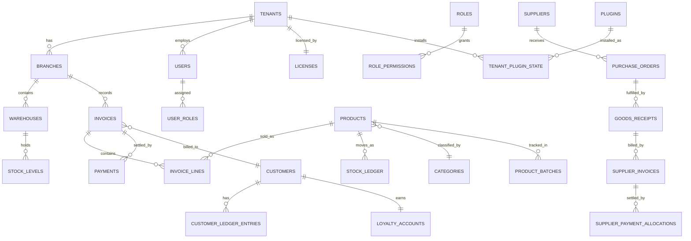

# Database Design & ERD

PostgreSQL 16+. Naming: `snake_case`, plural table names, surrogate `uuid` primary keys (`id`) for anything that syncs across branch↔cloud (avoids PK collisions from offline-generated rows), `bigint` identity only for purely local, never-synced, high-volume append logs (e.g. `audit_log_entries`) where uuid storage overhead isn't worth it. Every syncable table carries the columns in §1.

This document defines the **branch-local schema** (runs on each device's embedded Postgres) and calls out which tables are mirrored to the **cloud schema** (tenant master data + control plane). Money columns are `numeric(14,4)`; quantities `numeric(14,4)` (supports fractional units like weight). Timestamps are `timestamptz`, stored UTC.

## 1. Cross-Cutting Columns (every syncable entity)

| Column | Type | Purpose |
|---|---|---|
| `id` | uuid | Globally unique, generated client-side (uuidv7 for time-sortability) |
| `tenant_id` | uuid | Tenant isolation, denormalized onto every row (defense in depth + simplifies cloud rollup) |
| `branch_id` | uuid, nullable | Null for tenant-wide entities (e.g. `customers` can be tenant-wide) |
| `created_at` / `updated_at` | timestamptz | |
| `created_by` / `updated_by` | uuid → users.id | |
| `version` | integer | Optimistic concurrency + sync conflict detection (see §8) |
| `deleted_at` | timestamptz, nullable | Soft delete; hard delete is never used on financial data |
| `sync_status` | enum(`local_only`,`pending`,`synced`,`conflict`) | Sync Engine bookkeeping, not business data |

These are omitted from the per-table column lists below for brevity — assume they exist on every table unless marked `[local-only]` or `[cloud-only]`.

## 2. Identity & Tenancy

```
tenants            (id, name, legal_name, tax_id, base_currency, default_locale, status)
branches           (id, tenant_id, name, code, address, timezone, is_warehouse_only)
devices            (id, tenant_id, branch_id, fingerprint, os, app_version, status, approved_at, last_seen_at)  [cloud-owned, cached locally]
users              (id, tenant_id, branch_id_default, full_name, username, email, pin_hash, password_hash,
                    totp_secret, status, locale)
roles              (id, tenant_id, name, is_system_role)
permissions        (id, code, module, description)                                   -- seed data, not tenant-scoped
role_permissions   (role_id, permission_id, branch_scoped boolean)
user_roles         (user_id, role_id, branch_id nullable)                              -- nullable branch = tenant-wide grant
sessions           (id, user_id, device_id, refresh_token_hash, issued_at, expires_at, revoked_at)
login_history      (id, user_id, device_id, ip_address, success boolean, occurred_at)  [local append-only, synced to cloud audit store]
```

## 3. Licensing & Subscription `[cloud-owned, cached locally as read-only]`

```
licenses           (id, tenant_id, license_key_hash, plan_id, status, device_limit, branch_limit, user_limit,
                    starts_at, expires_at, grace_period_days, suspended_reason)
plans              (id, name, billing_cycle enum(monthly,quarterly,yearly,lifetime), price, currency,
                    included_module_codes text[])
license_events     (id, license_id, event_type enum(created,suspended,extended,upgraded,downgraded,revoked,reinstated),
                    actor_admin_id, payload jsonb, occurred_at)   -- audit trail, cloud-only
license_validations(id, license_id, device_id, validated_at, signed_token, result enum(ok,expired,suspended,revoked))
```

## 4. Plugin Marketplace `[cloud-owned + local entitlement cache]`

```
plugins            (id, code, name, version, manifest jsonb, package_url, checksum, status enum(draft,published,deprecated))
plugin_plan_grants (plugin_id, plan_id)                          -- plugins included free in a plan
plugin_purchases   (id, tenant_id, plugin_id, price_paid, purchased_at, status enum(active,cancelled))
tenant_plugin_state(tenant_id, plugin_id, is_installed, is_active, installed_version, settings jsonb)  [synced to device]
```

## 5. Catalog / Product

```
categories         (id, parent_id nullable, name, sort_order)
brands             (id, name)
units              (id, name, symbol, is_fractional boolean)
tax_templates       (id, name, is_inclusive boolean)
tax_components      (id, tax_template_id, name, rate_percent, sort_order)   -- supports stacked components e.g. VAT+Excise
products           (id, sku, barcode, name, description, category_id, brand_id, unit_id, tax_template_id,
                    cost_price, sale_price, image_url, track_batches boolean, track_expiry boolean,
                    track_serials boolean, reorder_level, product_type enum(standard,variant_parent,variant_child,bundle,kit),
                    parent_product_id nullable)
product_variant_attributes (id, product_id, attribute_name, attribute_value)        -- e.g. Size=L, Color=Red on a variant_child
bundle_components  (bundle_product_id, component_product_id, quantity)              -- for product_type = bundle
kit_components     (kit_product_id, component_product_id, quantity)                 -- for product_type = kit (consumed at assembly)
product_batches    (id, product_id, batch_no, expiry_date, received_at)
product_serials    (id, product_id, serial_no, status enum(in_stock,sold,returned), invoice_line_id nullable)
price_lists        (id, name, currency, is_default)
price_list_items   (price_list_id, product_id, price)
```

## 6. Inventory

```
warehouses         (id, branch_id, name, is_default)
stock_levels       (warehouse_id, product_id, batch_id nullable, quantity_on_hand, quantity_reserved)  -- materialized projection
stock_ledger       (id, warehouse_id, product_id, batch_id nullable, movement_type enum(
                      purchase_receipt, sale, sale_return, purchase_return, adjustment,
                      transfer_out, transfer_in, kit_assembly_consume, kit_assembly_produce, opening_balance),
                    quantity_delta, unit_cost_at_movement, reference_table, reference_id, occurred_at)  -- append-only, source of truth
stock_adjustments  (id, warehouse_id, reason_code, note, status enum(draft,posted))
stock_adjustment_lines (stock_adjustment_id, product_id, batch_id nullable, counted_quantity, system_quantity)
stock_transfers    (id, from_warehouse_id, to_warehouse_id, status enum(draft,dispatched,received,cancelled))
stock_transfer_lines (stock_transfer_id, product_id, batch_id nullable, quantity)
```

`stock_levels` is rebuildable at any time by replaying `stock_ledger` — this is the recovery mechanism if a projection ever drifts (see [12-testing-strategy.md](12-testing-strategy.md) for the reconciliation test that asserts this invariant continuously).

## 7. Sales / POS

```
invoices           (id, branch_id, invoice_no, invoice_type enum(sale,return), customer_id nullable,
                    cashier_id, status enum(held,completed,voided), subtotal, discount_total, tax_total,
                    grand_total, currency, fx_rate_to_base, original_invoice_id nullable  -- set on returns
                    void_reason nullable, voided_by nullable, voided_at nullable)
invoice_lines      (id, invoice_id, product_id, batch_id nullable, serial_id nullable, quantity, unit_price,
                    discount_type enum(percent,fixed) nullable, discount_value, tax_amount, line_total,
                    original_invoice_line_id nullable)   -- links a return line back to the sold line
invoice_discounts  (invoice_id, discount_type enum(percent,fixed), value, reason)
payments           (id, invoice_id, method enum(cash,debit_card,credit_card,bank_transfer,mobile_wallet,credit_sale,store_credit,gift_card),
                    amount, reference, received_amount nullable, change_amount nullable)
held_invoices      (invoice_id, label, held_at)   -- thin wrapper; a held invoice is just an invoice with status=held
cash_drawer_sessions (id, branch_id, terminal_id, opened_by, opening_float, closed_by, closing_count, expected_close, variance, opened_at, closed_at)
```

## 8. Customers, Suppliers, Credit

```
customers          (id, name, phone, email, address, tax_number, credit_limit, default_price_list_id, tags text[])
customer_ledger_entries (id, customer_id, entry_type enum(invoice,payment,return,opening_balance), amount, balance_after,
                    reference_table, reference_id, occurred_at)
loyalty_accounts   (customer_id, points_balance, membership_level_id)
membership_levels  (id, name, min_lifetime_spend, point_multiplier)
coupons            (id, code, discount_type enum(percent,fixed), value, max_uses, used_count, valid_from, valid_to, stackable boolean)
gift_cards         (id, code, initial_balance, current_balance, status enum(active,redeemed,expired))
suppliers          (id, name, phone, email, address, tax_number)
supplier_ledger_entries (id, supplier_id, entry_type enum(purchase_invoice,payment,return,opening_balance), amount, balance_after,
                    reference_table, reference_id, occurred_at)
```

## 9. Purchasing

```
purchase_orders    (id, supplier_id, warehouse_id, status enum(draft,sent,partially_received,received,cancelled), expected_at)
purchase_order_lines (purchase_order_id, product_id, quantity_ordered, unit_cost)
goods_receipts     (id, purchase_order_id nullable, warehouse_id, received_at, status enum(draft,posted))
goods_receipt_lines (goods_receipt_id, product_id, batch_id nullable, quantity_received, unit_cost)
supplier_invoices  (id, supplier_id, goods_receipt_id nullable, invoice_no, amount, due_date, status enum(unpaid,partially_paid,paid))
supplier_payments  (id, supplier_id, amount, method, paid_at)
supplier_payment_allocations (supplier_payment_id, supplier_invoice_id, amount_allocated)
purchase_returns   (id, goods_receipt_id, warehouse_id, reason, status enum(draft,posted))
purchase_return_lines (purchase_return_id, product_id, batch_id nullable, quantity, unit_cost)
```

## 10. Accounting Lite

```
expense_categories (id, name)
expenses           (id, branch_id, category_id, amount, note, paid_via, occurred_at)
income_entries     (id, branch_id, category, amount, note, occurred_at)   -- non-sales income
daily_closings     (id, branch_id, business_date, expected_cash, counted_cash, variance, closed_by, closed_at)
```

## 11. Reporting (materialized aggregates — refreshed on schedule + on-demand for "today")

```
daily_sales_summary    (branch_id, business_date, gross_sales, discounts, tax_collected, net_sales, cogs, gross_profit, invoice_count)
product_performance_mv (product_id, branch_id, business_date, qty_sold, revenue, cogs)
customer_rfm_mv        (customer_id, last_purchase_at, frequency_90d, monetary_90d)
```

These are Postgres materialized views (or, for "today", a plain query with a tight cache TTL — `REFRESH MATERIALIZED VIEW CONCURRENTLY` doesn't suit same-day freshness needs).

## 12. Security & Audit

```
audit_log_entries  (id bigint identity, tenant_id, branch_id, actor_user_id, action, entity_table, entity_id,
                    before jsonb, after jsonb, occurred_at)   [local-only, batched-synced to cloud cold storage]
notifications      (id, user_id, type, payload jsonb, read_at, created_at)
```

## 13. Multi-Currency & Settings

```
currencies         (code, name, symbol, decimal_places)        -- seed: PKR, QAR, AED, SAR, USD, EUR, GBP
exchange_rates      (base_currency, quote_currency, rate, effective_at)
tenant_settings     (tenant_id, key, value jsonb)
branch_settings     (branch_id, key, value jsonb)               -- overrides tenant_settings
printers            (id, branch_id, name, type enum(thermal80,thermal58,a4,pdf), connection jsonb)
```

## 14. ERD (core relationships)



## 15. Indexing Strategy (high-traffic paths)

- `invoices(branch_id, status, created_at desc)` — POS history/search.
- `products(tenant_id, barcode)` unique partial where `deleted_at is null` — barcode scan lookup.
- `stock_levels(warehouse_id, product_id)` unique — point lookup on every cart add.
- `stock_ledger(product_id, warehouse_id, occurred_at)` — ledger replay/audit.
- `customer_ledger_entries(customer_id, occurred_at desc)` — statement rendering.
- GIN index on `audit_log_entries(before, after)` jsonb columns only if ad-hoc audit search becomes a real requirement (deferred — don't pay the write cost until needed).

## 16. Branch-Local vs Cloud Split

| Lives primarily on device | Lives primarily in cloud | Bidirectionally synced |
|---|---|---|
| invoices, invoice_lines, payments, stock_ledger, stock_levels, cash_drawer_sessions, audit_log_entries (originate local) | tenants, licenses, plans, license_events, plugins, plugin_purchases, devices | products, categories, customers, suppliers, users, roles, tenant_settings, tenant_plugin_state |

Rule of thumb: anything generated by day-to-day terminal activity is **device-authoritative** and pushed up; anything that defines *how the business is configured* is **cloud-authoritative** and pulled down, with local edits queued and reconciled (last-writer-wins per field, with a conflict log for financial-impacting fields — full algorithm in [04-electron-architecture.md](04-electron-architecture.md) §Sync Engine).
